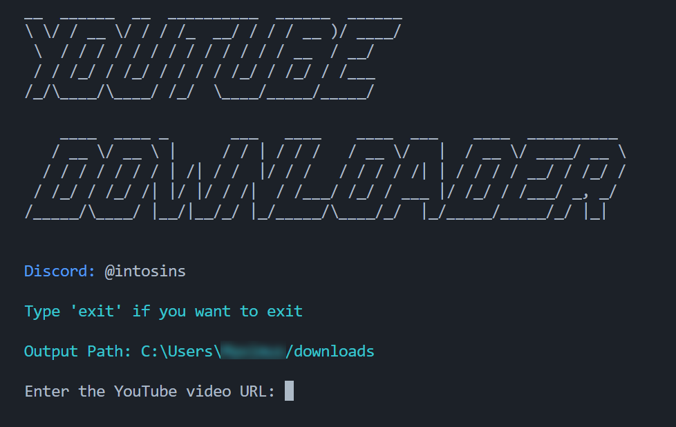

# YouTube Downloader Terminal


YouTube Downloader Terminal is a Python-based tool designed for downloading YouTube videos directly from your terminal.

## Screenshots



## Features

- Very simple to use.
- You can download any YouTube video just by providing url.
- Allows you to pick low or high quality before downloading YouTube video.

## Cons

- Unhandled exceptions.

## Discord


Discord: @intosins
  
## Usage

The YouTube Downloader Terminal is designed to run on Windows 10, Windows 8, and Windows 7 operating systems. And may not work on other OS (like Linux).

Please note that you should have Python 3 installed on your system to run the tool successfully. The script was coded using Python version 3.11.4.

Just download main.py and run it in VS studio code to use downloader.

```bash
1. Install the required dependencies:

pip install pytube pyfiglet colorama

pip install pytube
pip install pyfiglet
pip install colorama

2. Clone the repository:
git clone https://github.com/intosins/youtube-downloader-terminal.git
cd youtube-downloader-terminal
